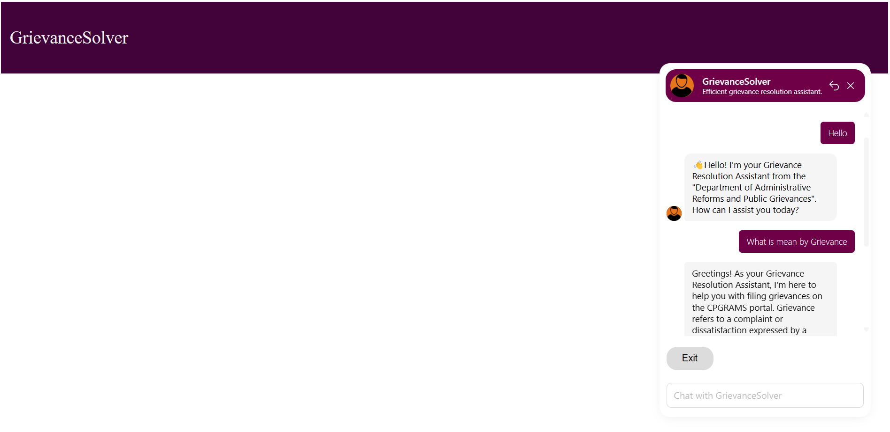

# CPGRAMS Chatbot

## Project Information
The CPGRAMS Chatbot is an AI-driven virtual assistant designed to streamline the grievance resolution process for citizens. It is built to operate within the CPGRAMS portal (https://pgportal.gov.in), providing users with step-by-step guidance on filing grievances, real-time assistance, and intelligent recommendations.

## Usage
1. Create a new chatbot on BootPress website.
2. Upload the provided chatbot file (`Chatbot.bpz`) to your BootPress chatbot project.
3. Configure the chatbot settings and integrations within your BootPress project dashboard.
4. Deploy the chatbot on your website or application using the provided integration options.
5. To run the project locally, open the `main.html` file in your web browser.

## Screenshots
*After running the project locally, click on the chatbot button located at the bottom right corner.*

*The chatbot interface will open up, allowing you to ask your questions.*

*You can minimize the chatbot interface when not in use.*

  

